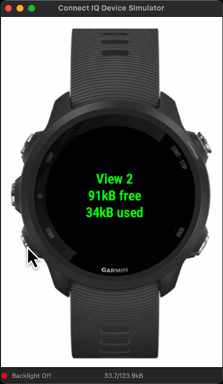

This is a simple example of Garmin watch application. The Connect IQ app lets the user to open/close views ("screens") and consume/free some device memory.

It will be used in a tutorial that demonstrates Memory Viewer of the Connect IQ Device simulator.

# Building and running the project
This project contains configuration files that allows for opening the project in [Visual Studio Code] with [Monkey C extension](https://marketplace.visualstudio.com/items?itemName=garmin.monkey-c). 
(Visit the documentation or see dedicated tutorial to set up the environment.)

# App controls
Creating/closing a view happens when in [onNextPage()](https://developer.garmin.com/connect-iq/api-docs/Toybox/WatchUi/BehaviorDelegate.html#onNextPage-instance_function) and [onPreviousPage()](https://developer.garmin.com/connect-iq/api-docs/Toybox/WatchUi/BehaviorDelegate.html#onPreviousPage-instance_function) functions.

For the devices with buttons (for example, Fenix 5, Forerunner 235, etc.) you can invoke the following actions:
* Create and show new view -- down button
* Close current view -- up button

For the devices with a touch screen (for example, Fenix 7, Venue, etc.) onNextPage/onPreviousPage are usually triggered by swiping the touch screen up and down (SWIPE_UP/SWIPE_DOWN events).

There is additional action: forcing to refresh the screen. It happens in [onSelect()](https://developer.garmin.com/connect-iq/api-docs/Toybox/WatchUi/BehaviorDelegate.html#onSelect-instance_function) function. For button devices it is triggered usually by Start/Enter button. For touch screen devices it is usually triggered by tapping the screen (CLICK_TYPE_TAP ClickEvent).

# Contributing
This is an open-source project and all contributions are welcomed.

If you find a bug or have an idea on how to make the example better/simpler/more readable, please, submit an issue (or even PR). 